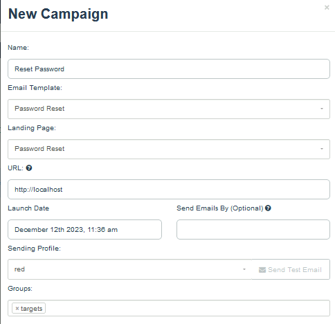

# Campaign-Phishing-with-GoPhish
I show the important steps required to perform a campaign phishing.  
# Introduction of the tool
## GoPhish
GoPhish is an open-source tool that helps you test the vulnerability of your organization to phishing attacks.  
Phishing is a type of cyberattack that tries to trick people into revealing sensitive information or installing malicious software by sending them deceptive emails.  
GoPhish allows you to create realistic phishing campaigns, send them to your employees or clients, and track the results in real time. You can also use GoPhish to train your staff on how to recognize and avoid phishing emails.  
GoPhish is designed for businesses and penetration testers who want to improve their security awareness and prevent data breaches. 
 
GoPhish makes you launch a Campaign in 3 steps: 
- Set Profiles, Landing pages, Templates & Targets
- Launch the Campaign Phishing
- Track Results
 

## Campaign Phishing with GoPhish  
Remember to save all the settings at every step. 
1) **Start the gophish server** 
2) **Go to the URL and log in with the credentials**  
 
3) **Set a New profile**  
  
4) **Send a test email and check in your mailbox, you should receive the test email** 
  
5) **Set a New landing page, specify the page on import site, it's the page where they will be redirect when someone click your link, in my case localhost:8080, and active the capture of submitted data and passwords** 
   
6) **Set a New template, click on Import Email and paste the code of the email template (download an email template or create a custom one)** 
  
7) **Set a New Group with importing a file.csv** 
  
**Example file CSV**  
  
8) **Set a New Campaign and Launch it** 
  

**This screenshot it's an example of email that they will receive. If they will click on Reset Password, they will be redirect into localhost:8080 where there is my fake reset password page.**  
 

#Author
<b>Xiao Li Savio Feng</b>
